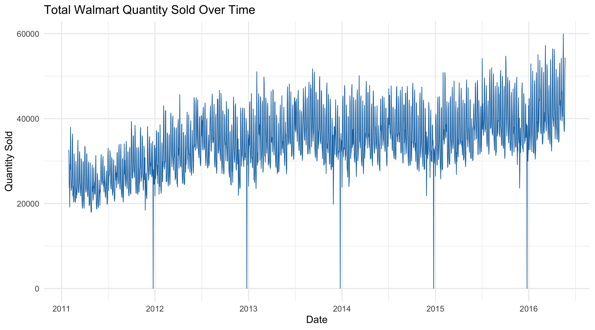
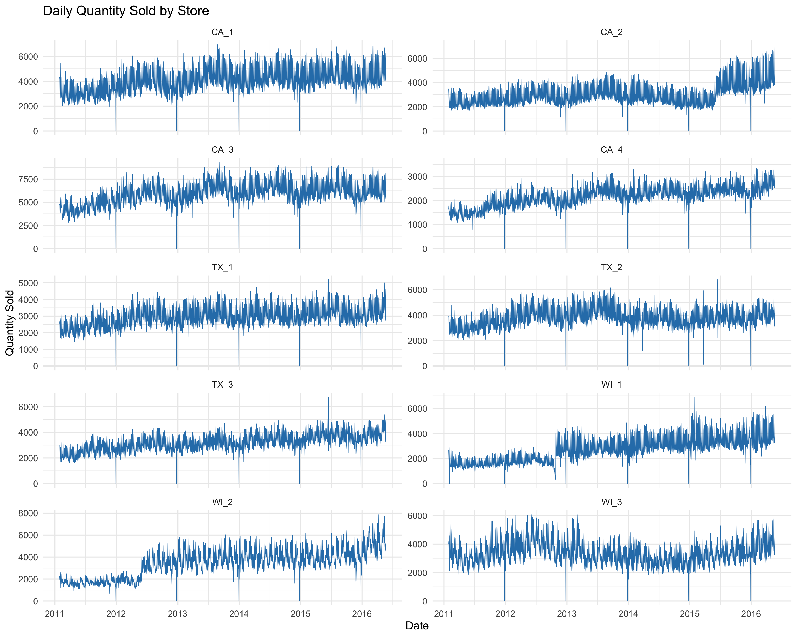
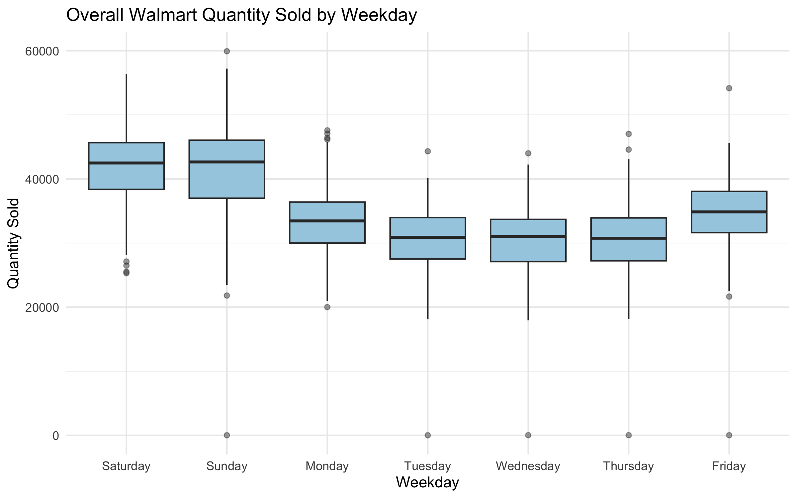
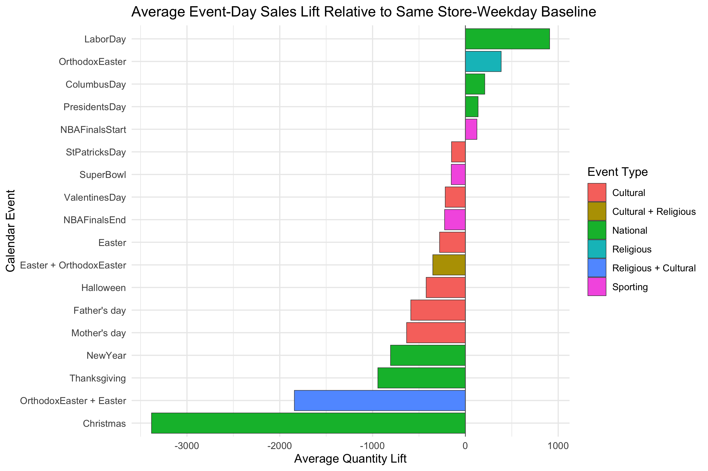
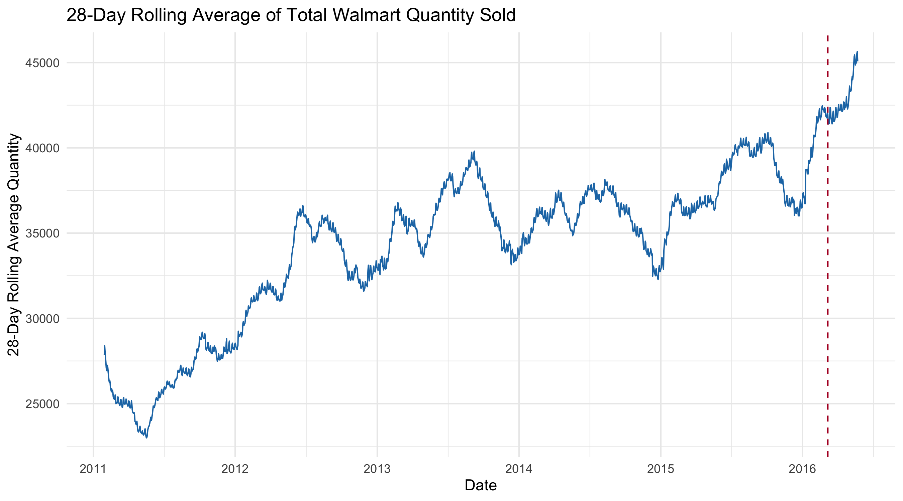
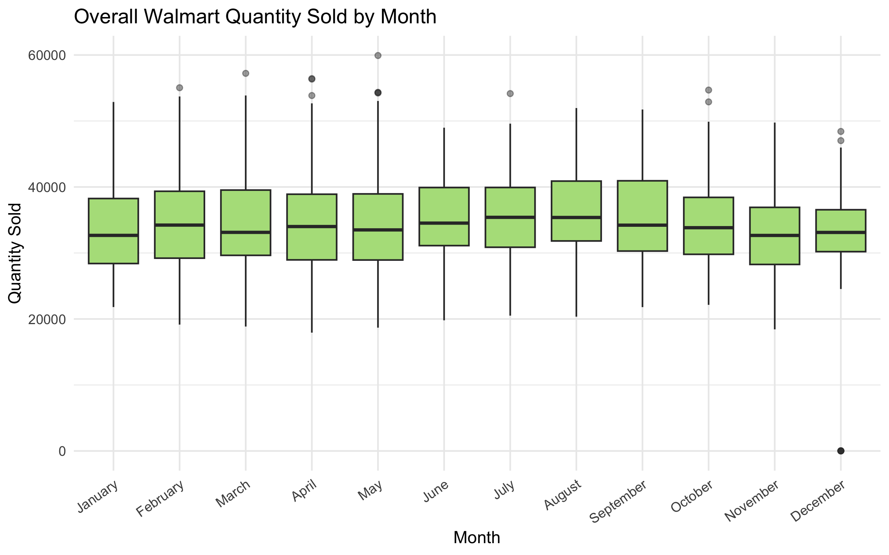
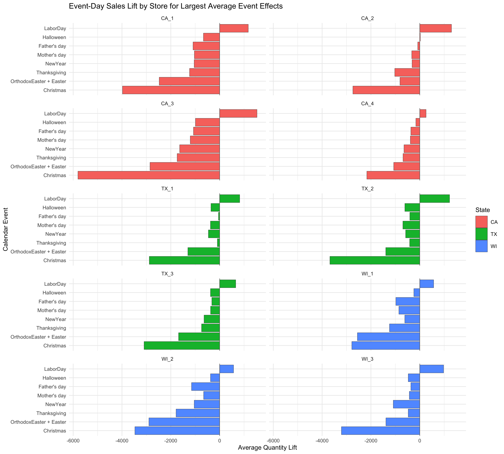

---
format:
  revealjs:
    css: walmart_presentation.css
    embed-resources: true
    slide-number: c/t
    show-slide-number: all
    controls: true
    controls-layout: edges
    controls-tutorial: false
    progress: true
    navigation-mode: linear
    transition: fade
    background-transition: fade
    width: 1600
    height: 900
    margin: 0.045
    center: false
    hash: true
    history: false
    scrollable: false
    auto-stretch: false
    default-timing: 0
slide-level: 2
execute:
  echo: false
  warning: false
  message: false
---

## Walmart Sales Time Series Analysis {data-timing="20" .title-slide}

ECON 491

Bo, Shumei, Joyce, Siddharth

::: {.notes}
**Time: 0:20**

- Each group member says their name.
- Opening prompt: "We studied daily Walmart sales to understand what changes over time and what patterns may help with forecasting."
- Face the audience after reading the title.
:::

## The M5 dataset {data-timing="50"}

:::: {.columns .context-layout}
::: {.column width="46%"}

THE PURPOSE

The M5 competition used historical Walmart sales to study and forecast customer demand.

<strong>Quantity sold</strong> 
The number of individual items customers purchased.

:::

::: {.column width="50%"}

WHAT THE DATA RECORD

- Daily sales for thousands of products
- Products sold in 10 stores across 3 states
- Dates, weekdays, holidays, and other calendar events
- A history from January 2011 through May 2016
:::
::::

::: {.notes}
**Time: 0:50**

- Assume the audience has never heard of M5.
- Explain that demand means how much customers buy.
- Clarify that quantity counts units, not dollars or revenue.
- Transition: "The raw files are detailed, so we changed the level of the data for this analysis."
:::

## One observation in the final dataset {data-timing="55"}

One Walmart store on one date

| Store | Date | Total quantity | State | Weekday | Event |
|:--|:--|--:|:--|:--|:--|
| CA_1 | March 6, 2016 | 6,829 units | California | Sunday | None listed |

Product quantities within CA_1 on this date were added together to produce 6,829 units.

<strong>Store</strong> identifies the location. <strong>Date</strong> identifies the day. <strong>Calendar variables</strong> describe when that day occurred.

::: {.notes}
**Time: 0:55**

- Point to the example row and define each field from left to right.
- Explain that a product no longer has its own row after aggregation.
- Total quantity means the sum of every product sold in that store on that date.
- Transition: "Here is how we moved from the original files to this simpler structure."
:::

## Preparing daily store sales {data-timing="55"}

1
<strong>Combine</strong>
Train and test days form one continuous sales history.

2
<strong>Reshape</strong>
Day columns such as <code>d_1</code> become individual rows.

3
<strong>Sum</strong>
Product quantities are added within each store and day.

4
<strong>Add calendar data</strong>
Each day receives its date, weekday, and event information.

<strong>Result:</strong> 19,410 rows with one row for every store and date.

::: {.notes}
**Time: 0:55**

- Walk through the four numbered steps without describing R code.
- Emphasize that quantities were summed before adding calendar information.
- Explain that train and test represent consecutive dates, not different stores or products.
- Transition: "Before graphing the data, we checked that this structure was complete."
:::

## Data coverage and checks {data-timing="30"}

<strong>10</strong>stores

<strong>3</strong>states

<strong>1,941</strong>daily dates

<strong>19,410</strong>final rows

January 29, 2011 to May 22, 2016

No duplicate store and date rows
No missing dates
No missing quantities

::: {.notes}
**Time: 0:30**

- Explain the row-count check: 10 stores multiplied by 1,941 dates equals 19,410 rows.
- Say that selected totals also matched the raw product data exactly.
- Do not read every check. Pause briefly on the complete date coverage.
- Transition: "With the structure verified, we can look at how sales changed over time."
:::

## Sales generally rise over time {data-timing="55"}

::: {.chart-stage .crop-chart-title}
{fig-alt="Line chart of total Walmart quantity sold each day from 2011 through May 2016."}
:::

<strong>Trend:</strong> later years usually have higher sales<strong>Pattern:</strong> regular weekly movement<strong>Exceptions:</strong> Christmas drops and several high spikes

::: {.notes}
**Time: 0:55**

- The line adds all 10 stores for each date.
- Point out the general rise from 2011 to 2016.
- The repeated up-and-down pattern suggests weekly seasonality.
- The drops near zero occur on Christmas Day.
- Mention the high March 2016 value, which we investigate later.
- Transition: "The overall line is useful, but stores do not all behave at the same level."
:::

## Stores have different sales levels {data-timing="50"}

::: {.chart-stage .store-chart .crop-chart-title}
{fig-alt="Ten panels showing daily quantity sold for each Walmart store."}
:::

<strong>CA_3</strong> usually sells more units than <strong>CA_4</strong>. Christmas drops appear across nearly every store.

::: {.notes}
**Time: 0:50**

- Each small panel represents one store.
- Compare CA_3 with CA_4 to make store differences concrete.
- Point out that the sharp Christmas drops repeat across stores.
- Explain why a later model may need store effects.
- Transition: "The most consistent short-term pattern comes from the day of the week."
:::

## Weekends have the highest sales {data-timing="55"}

::::: {.columns .chart-and-number}
:::: {.column width="72%"}
::: {.chart-stage .weekday-chart .crop-chart-title}
{fig-alt="Boxplots comparing total Walmart quantity sold across the seven weekdays."}
:::
::::

:::: {.column width="25%"}

Highest median
<strong>42,648</strong>
units on Sunday

Lowest median
<strong>30,757</strong>
units on Thursday

::::
:::::

::: {.notes}
**Time: 0:55**

- Explain that the line inside each box marks a typical value, the median.
- Saturday and Sunday sit clearly above the middle of the week.
- Sunday has the highest median, while Thursday has the lowest median.
- The zero points come from Christmas dates, not ordinary Sundays or weekdays.
- Transition: "Calendar events create another pattern beyond the normal weekday cycle."
:::

## Holidays affect sales differently {data-timing="60"}

::: {.chart-stage .event-chart .crop-chart-title}
{fig-alt="Horizontal bars showing average event-day sales lift compared with the same store and weekday on normal dates."}
:::

<strong>Christmas:</strong> about 3,382 fewer units per store. <strong>Labor Day:</strong> about 908 more units per store.

::: {.notes}
**Time: 1:00**

- Define the baseline before interpreting the bars: a normal non-event day for the same store and weekday.
- Bars left of zero mean lower sales than that baseline. Bars right of zero mean higher sales.
- Christmas has the strongest negative association. Thanksgiving and New Year are also below normal.
- Labor Day has the largest positive association.
- State clearly: these are associations, not proof that the events caused the changes.
- Transition: "One unusually high date did not have a listed calendar event."
:::

## The March 2016 spike is real but unexplained {data-timing="60"}

::::: {.columns .spike-layout}
:::: {.column width="68%"}
::: {.chart-stage .spike-chart .crop-chart-title}
{fig-alt="Rolling average of total Walmart quantity with March 6, 2016 marked by a vertical dashed line."}
:::
::::

:::: {.column width="28%"}
::: {.spike-facts}
**57,218 units**

sold on March 6, 2016

***

Raw and prepared totals match.

All stores contributed.

Sales returned to their previous range.
:::
::::
:::::

The available calendar variables do not explain this one-day increase.

::: {.notes}
**Time: 1:00**

- The red line marks the spike date on the 28-day rolling-average graph.
- The raw product sum, store-level sum, and plotted total all equal 57,218.
- California contributed about half of the increase, but all states and stores contributed.
- No single product dominated the increase.
- The level before and after the spike is similar, so this EDA does not show a persistent structural break.
- Possible explanations such as promotions or weather require information outside these files.
- Transition: "Together, these patterns tell us what a forecasting model should consider next."
:::

## What we learned {data-timing="45"}

<strong>Time</strong>Sales levels generally rise across the sample.

<strong>Weekday</strong>Weekend demand is much higher than midweek demand.

<strong>Store</strong>Locations have different normal sales levels.

<strong>Events</strong>Some holidays show large, repeatable differences.

<strong>Outliers</strong>Known holidays and unexplained spikes need separate attention.

Next question: which of these patterns meaningfully improves a forecasting model?

::: {.notes}
**Time: 0:45**

- Summarize the findings in your own words rather than reading the five lines.
- The strongest recurring pattern is the weekly cycle.
- Store and event information should also be tested in a later model.
- Month effects remain possible, but the raw month comparison mixes seasonality with trend.
- Transition: "That completes our exploratory analysis. We are happy to take questions."
:::

## Questions {data-timing="0" .questions-slide}

Questions?

Bo, Shumei, Joyce, Siddharth

Backup slides follow

::: {.notes}
**Time: remaining presentation time**

- Thank the audience.
- Stop on this slide unless a question requires one of the backup figures.
- Press S before presenting to open speaker view. Use the next arrow only when moving into the appendix.
:::

## Monthly sales patterns {data-visibility="uncounted" data-timing="0" .appendix-slide}

BACKUP

::: {.chart-stage .month-chart .crop-chart-title}
{fig-alt="Boxplots comparing total Walmart quantity sold across months of the year."}
:::

The month pattern is weaker than the weekday pattern. Trend and incomplete edge months limit a direct comparison.

::: {.notes}
- Use only if asked about longer seasonal cycles.
- July has the highest median. November has the lowest median.
- January 2011 and May 2016 are incomplete months.
- A later model should separate trend from month effects before interpreting them.
:::

## Event effects differ by store {data-visibility="uncounted" data-timing="0" .appendix-slide}

BACKUP

::: {.chart-stage .event-store-chart .crop-chart-title}
{fig-alt="Ten store panels comparing event-day sales lift for the events with the largest average effects."}
:::

Christmas is negative and Labor Day is positive across all stores, but the size of each association varies.

::: {.notes}
- Use only if asked whether event patterns are the same for every store.
- Christmas is negative in every panel. Labor Day is positive in every panel.
- Different effect sizes support testing store and event interactions later.
- Repeat that these are descriptive associations rather than causal estimates.
:::
